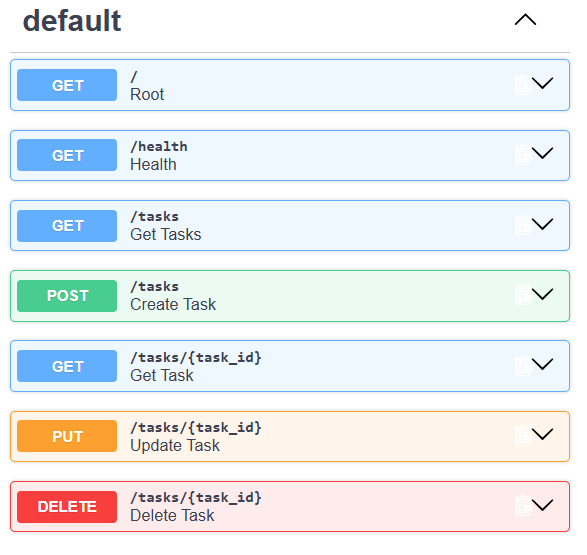

# Task Management API

A beginner-friendly REST API for managing tasks, built with Python and FastAPI.

This project implements CRUD (Create, Read, Update, Delete) operations using an in-memory list, with input validation, proper HTTP status codes, and interactive Swagger API documentation.

## Tech Stack

- Python 3.10+
- FastAPI
- Uvicorn
- Pydantic
- Git & GitHub

## Features

- Create tasks
- View all tasks
- View a single task by ID
- Update tasks
- Delete tasks
- Validate task titles
- Handle 404 errors for missing tasks
- Interactive Swagger documentation

## Installation & Running

Create and activate a virtual environment:

```bash
python -m venv venv

## Git Bash
source venv/Scripts/activate

## Install dependencies:
pip install fastapi uvicorn

## Start the server:
uvicorn main:app --reload

## The API will be available at:
http://127.0.0.1:8000

## Swagger UI:
http://127.0.0.1:8000/docs

## API Endpoints

| Method | Endpoint | Description |
|---|---|---|
| GET | `/` | Check that the API is running |
| GET | `/health` | Health check |
| GET | `/tasks` | Get all tasks |
| GET | `/tasks/{task_id}` | Get a task by ID |
| POST | `/tasks` | Create a new task |
| PUT | `/tasks/{task_id}` | Update an existing task |
| DELETE | `/tasks/{task_id}` | Delete a task |

## Example Request

### Create a Task

```http
POST /tasks

## Request Body
{
  "title": "Learn FastAPI"
}

## Successful response
{
  "id": 4,
  "title": "Learn FastAPI"
}

## Status
201 Created

## Validation

A task title cannot be empty or missing.

Example:

```json
{
  "title": ""
}

## Returns
400 Bad Request

## Error Handling

If a task ID does not exist, the API returns:

```json
{
  "detail": "Task not found"
}
with
404 Not Found

## Swagger Documentation

The API includes interactive Swagger documentation provided by FastAPI.

Open:

http://127.0.0.1:8000/docs


## Project Structure

```text
task-management-api/
│
├── main.py
├── README.md
├── .gitignore
└── venv/

## Storage

This project uses an in-memory Python list for task storage.

This means tasks are reset whenever the server restarts. No external database is used.

## Status Codes

| Status Code | Meaning |
|---|---|
| 200 | Successful request |
| 201 | Task successfully created |
| 204 | Task successfully deleted |
| 400 | Invalid task data |
| 404 | Task not found |

## Author

Tejashwini